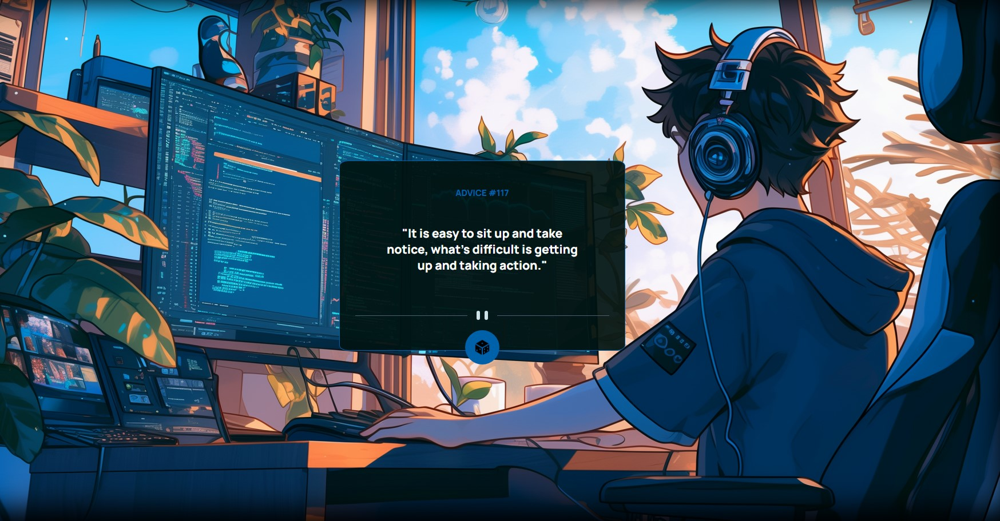
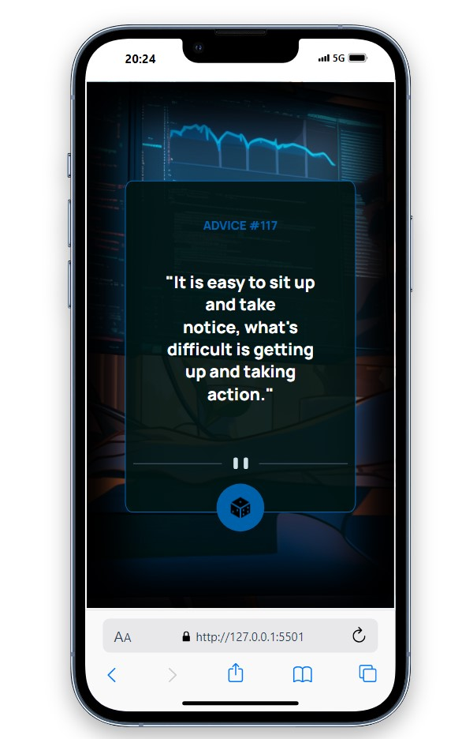

# DESAFIO FRONTEND MENTOR


<br>
<!-- <br> -->

# Sobre o Projeto

## Buscando sabedoria ancestral? ##
Este projeto te entrega conselhos místicos a um clique de distância! 🧙‍♂️
Construído no desafio do Frontend Mentor, este app minimalista consome uma API de conselhos e entrega sabedoria instantânea para qualquer dilema. 🪄 Uma ótima forma de praticar minhas habilidades em:
Consumo de APIs: Requisições assíncronas? Dominei! 📡
Javascript: Manipulação do DOM para exibir as respostas da API de forma dinâmica e elegante. 💻
Interface responsiva: Busque conselhos de qualquer dispositivo! 📱💻
Veja o código fonte e experimente você mesmo! (https://github.com/DEV-Cafe096/gerador_de_conselhos)

<br>
<br>

# Visualização do Projeto




## Tecnologias utilizadas

- HTML     
- CSS   
- Javascript
- API: https://api.adviceslip.com/#endpoint-random

## Como utilizar

1-clone para o projeto
```
git clone <url>
```

2-Acesse a pasta do projeto
```
cd repositorio-com-readme
```

## Sua Opinião Importa

Se você explorou O projeto e tem alguma observação, sugestão ou apenas deseja entrar em contato, por favor, compartilhe conosco. Valorizamos seu feedback e estamos constantemente buscando maneiras de melhorar. Seu insight é valioso e ajuda a aprimorar nosso projeto. Não hesite em nos contatar, mesmo que seja apenas para dizer "oi." Aguardamos ansiosamente seu contato e agradecemos sua participação em nossa jornada.


